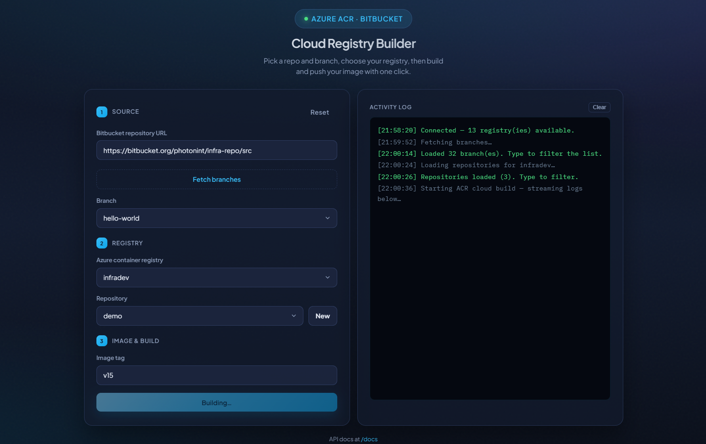
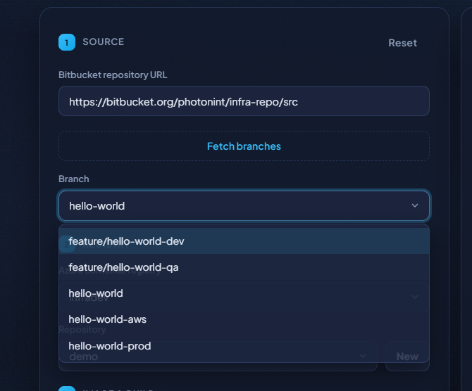
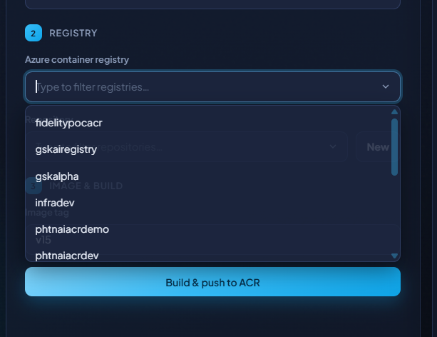
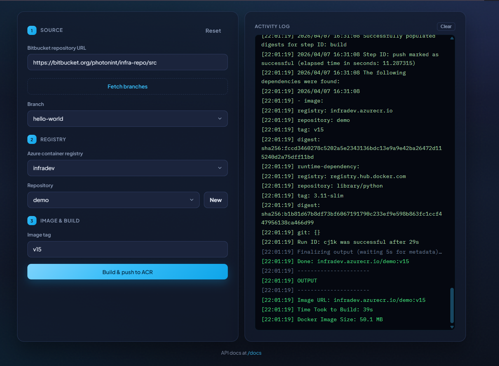

# Azure Registry Builder

A full-stack web application for seamlessly building Docker images from Bitbucket repositories and pushing them to Azure Container Registry (ACR). Features a modern UI, real-time build logs, and integrated Swagger API documentation.

---

## 📋 Project Overview

**Cloud Registry Builder** simplifies the CI/CD workflow by providing a user-friendly interface to:

1. **Select a Bitbucket Repository** - Browse and clone Bitbucket repositories
2. **Choose a Branch** - Fetch and select specific Git branches
3. **Configure Azure Registry** - Select Azure Container Registry (ACR) and target repository
4. **Build & Push** - Automatically build Docker images and push to ACR with real-time streaming logs

### Key Features

- 🔐 **Integrated Authentication** - Bitbucket and Azure credentials securely configured
- 📊 **Real-time Logs** - Stream build and deployment logs directly to the frontend
- 🎨 **Modern UI** - Clean, responsive web interface built with vanilla JS
- 📚 **API Documentation** - Auto-generated Swagger/OpenAPI documentation
- 🐳 **Docker Integration** - Seamless Docker build and ACR push capabilities
- ⚡ **Express.js Backend** - Robust Node.js REST API

---

## 🏗️ Architecture

```
┌─────────────────────────────────────────────────────────────┐
│                      Frontend (Browser)                       │
│  (HTML/CSS/JS in /public) - Cloud Registry Builder UI         │
└──────────────────────┬──────────────────────────────────────┘
                       │ HTTP/WebSocket
                       ▼
┌─────────────────────────────────────────────────────────────┐
│              Express.js Backend (Node.js)                     │
│                   server.js (Port 3000)                       │
├──────────────────────────────────────────────────────────────┤
│  Routes:                                                       │
│  ├─ /api/git       → Git operations (Bitbucket)              │
│  ├─ /api/azure     → Azure registry operations               │
│  ├─ /api/build     → Docker build & push operations          │
│  └─ /docs          → Swagger API documentation               │
├──────────────────────────────────────────────────────────────┤
│  Services (Utils):                                            │
│  ├─ gitService.js      → Bitbucket repo cloning & branching  │
│  ├─ azureService.js    → ACR registry/repo queries           │
│  └─ buildService.js    → Docker build & ACR push             │
├──────────────────────────────────────────────────────────────┤
│  Config:                                                       │
│  ├─ config/git.js      → Bitbucket credentials               │
│  └─ config/azure.js    → Azure credentials                   │
└──────────────────────────────────────────────────────────────┘
                       │
        ┌──────────────┴──────────────┐
        ▼                              ▼
┌──────────────────┐         ┌──────────────────┐
│  Bitbucket API   │         │   Azure CLI      │
│  (Git repos)     │         │   (ACR, Docker)  │
└──────────────────┘         └──────────────────┘
```

---

## 🚀 How to Run the Application

### Prerequisites

- **Node.js** v14+ and npm
- **Git** installed and configured
- **Azure CLI** installed (`az` command available)
- **Docker** installed (for container builds)
- **Bitbucket Account** with repository access
- **Azure Account** with Container Registry (ACR) instances

### Installation Steps

1. **Clone the repository**
   ```bash
   git clone <your-repo-url>
   cd cloud-registery
   ```

2. **Install dependencies**
   ```bash
   npm install
   ```

3. **Configure credentials** (see Configuration section below)
   ```bash
   # Edit config/git.js for Bitbucket
   # Edit config/azure.js for Azure
   ```

4. **Start the server**
   ```bash
   npm start
   # or for development with hot reload
   npm run dev
   ```

5. **Access the application**
   - Open browser: `http://localhost:3000`
   - API Docs: `http://localhost:3000/docs` (Swagger UI)

### Application Workflow

1. **Select Repository**: Enter a Bitbucket repository URL
2. **Get Branches**: Click "Get Branches" to fetch available branches
3. **Choose Branch**: Select the branch to build from
4. **Select Registry**: Pick an Azure Container Registry
5. **Enter Repository & Tag**: Specify the image name and version tag
6. **Build & Push**: Click "Build & Push" to start the process
   - Real-time logs stream to the UI as the build progresses
   - Image is automatically pushed to your Azure ACR upon completion

---

## 📸 Screenshots

### Main Interface
The application provides an intuitive 3-step workflow with real-time activity logs.



**Features visible:**
- **Source Panel**: Enter Bitbucket repository URL and fetch branches
- **Registry Panel**: Select Azure Container Registry and configure image details
- **Image & Build Panel**: Specify image tag and start the build process
- **Activity Log**: Real-time streaming logs showing build progress

### Step 1: Fetch Branches
After entering a Bitbucket repository URL and clicking "Fetch branches", the dropdown displays all available branches.



**Shows:**
- List of branches from the selected repository
- Branch names like `hello-world`, `feature/hello-world-dev`, `feature/hello-world-qa`, etc.
- Quick branch selection for build configuration

### Step 2: Select Registry
Browse available Azure Container Registries with a searchable dropdown for easy selection.



**Features:**
- Searchable list of all ACRs in your Azure account
- Registries like `fidelitypocacr`, `gskairegistry`, `gskalpha`, `infradev`, `phtnaiarcdemp`, `phtnaiacdev`
- Quick access to create new repositories with "New" button
- "Build & push to ACR" button ready to start the build

### Step 3: Build & Push with Live Logs
Watch real-time streaming logs as Docker builds your image and pushes to Azure ACR.



**Shows:**
- Successful branch selection (`hello-world`)
- Selected registry (`infradev`)
- Repository name (`demo`)
- Image tag (`v15`)
- Real-time activity log displaying:
  - Connection status: "Connected - 13 registry(ies) available"
  - Build progress and metrics
  - Docker image details (size: 50.1 MB)
  - Build completion summary: "Time Took to Build: 39s"
  - Final image URL: `infradev.azurecr.io/demo:v15`

---

## ⚙️ Configuration

### Required Configuration Files

You **must** configure credential files in the `/config` folder before running the application.

#### 1. `config/git.js` - Bitbucket Credentials

This file stores Bitbucket authentication credentials for cloning repositories.

```javascript
const gitConfig = {
  BITBUCKET_USER: "your-bitbucket-username",
  BITBUCKET_TOKEN: "your-bitbucket-app-password-or-token"
};

module.exports = { gitConfig };
```

**How to get these values:**
- **BITBUCKET_USER**: Your Bitbucket username
- **BITBUCKET_TOKEN**: Create an App Password in Bitbucket:
  1. Go to Bitbucket Settings → Personal Settings → App passwords
  2. Create a new app password with "Repositories: read" permission
  3. Copy the generated token (only shown once)

#### 2. `config/azure.js` - Azure Service Principal Credentials

This file stores Azure Active Directory (AAD) credentials for accessing Azure Container Registry.

```javascript
const azureConfig = {
  AZURE_CLIENT_ID: "your-azure-client-id",
  AZURE_TENANT_ID: "your-azure-tenant-id",
  AZURE_CLIENT_SECRET: "your-azure-client-secret"
};

module.exports = { azureConfig };
```

**How to get these values:**

You need to create an **Azure Service Principal**:

```bash
# Create a service principal (replace <subscription-id> with your subscription ID)
az ad sp create-for-rbac --name cloud-registry-builder \
  --role "Contributor" \
  --scopes "/subscriptions/<subscription-id>"
```

This returns:
- **appId** → use as `AZURE_CLIENT_ID`
- **tenant** → use as `AZURE_TENANT_ID`
- **password** → use as `AZURE_CLIENT_SECRET`

**Alternative: Export from existing service principal**
```bash
# List service principals
az ad sp list --display-name "cloud-registry-builder" --query "[].{id:appId}"

# Get tenant ID
az account show --query tenantId
```

Alternatively, you can authenticate with Azure CLI directly:
```bash
az login
```

The app will use your Azure CLI session if credentials aren't explicitly set.

#### 3. Azure Container Registry Setup

Ensure you have at least one **Azure Container Registry (ACR)** created:

```bash
# List your registries
az acr list --query "[].{name:name, resourceGroup:resourceGroup}"

# If you need to create one
az acr create --resource-group <group-name> \
  --name <registry-name> --sku Basic
```

#### 4. Repository Structure

Repositories being cloned must have a valid **Dockerfile** at the root:

```
bitbucket-repo/
├── Dockerfile          ← Required! Used by Docker build
├── src/
│   └── ...
├── package.json
└── ...
```

---

## 📡 API Endpoints

### Git Endpoints

- **POST** `/api/git/branches`
  - Fetch branches from a Bitbucket repository
  - Body: `{ "repoUrl": "https://bitbucket.org/org/repo.git" }`
  - Returns: `{ success: true, branches: ["main", "develop"] }`

### Azure Endpoints

- **GET** `/api/azure/registries`
  - List all Azure Container Registries
  - Returns: `{ success: true, registries: ["registry1", "registry2"] }`

- **POST** `/api/azure/repositories`
  - List repositories in a specific registry
  - Body: `{ "registryName": "myregistry" }`
  - Returns: `{ success: true, repositories: ["app1", "app2"] }`

### Build Endpoints

- **POST** `/api/build/push` (Streaming NDJSON response)
  - Build and push Docker image to ACR
  - Body:
    ```json
    {
      "repoUrl": "https://bitbucket.org/org/repo.git",
      "branch": "main",
      "registryName": "myregistry",
      "repository": "myapp",
      "tag": "v1.0.0"
    }
    ```
  - Streams real-time build logs as NDJSON

---

## 🔧 Troubleshooting

| Issue | Solution |
|-------|----------|
| **"Invalid Bitbucket URL"** | Ensure URL format: `https://bitbucket.org/org/repo.git` |
| **"Repository URL is required"** | Provide a valid Bitbucket repository URL |
| **Azure login errors** | Run `az login` or check credentials in `config/azure.js` |
| **Docker build failures** | Ensure your repo has a valid `Dockerfile` at root |
| **Spaces in image names** | Use hyphens or underscores, not spaces: `my-app`, not `my app` |
| **Port 3000 already in use** | Change PORT in `server.js` or kill the process using port 3000 |

---

## 📦 Dependencies

- **express** - Web framework
- **cors** - Cross-Origin Resource Sharing
- **dotenv** - Environment variable management
- **axios** - HTTP client
- **swagger-jsdoc** - Swagger/OpenAPI generation
- **swagger-ui-express** - Swagger UI serving
- **@google-cloud/artifact-registry** - Google Cloud Artifact Registry support

---

## 📝 Project Structure

```
cloud-registery/
├── server.js                 # Express app entry point
├── swagger.js                # Swagger/OpenAPI configuration
├── package.json              # Dependencies
├── Dockerfile                # App containerization
├── public/                   # Frontend (served as static)
│   ├── index.html           # Main UI
│   ├── app.js               # Frontend logic
│   └── styles.css           # Styling
├── config/                   # Configuration files (CRITICAL)
│   ├── git.js               # Bitbucket credentials
│   └── azure.js             # Azure credentials
├── routes/                   # Express route handlers
│   ├── gitRoutes.js         # /api/git endpoints
│   ├── azureRoutes.js       # /api/azure endpoints
│   └── buildRoutes.js       # /api/build endpoints
├── utils/                    # Service layer logic
│   ├── gitService.js        # Bitbucket operations
│   ├── azureService.js      # Azure operations
│   └── buildService.js      # Docker build/push operations
├── repos/                    # Temporary directory for cloned repos
├── scripts/                  # Helper scripts (Windows/cloud specific)
└── README.md                 # This file
```

---

## ⚖️ License

ISC

---

## 💡 Notes

- Temporary cloned repositories are stored in `/repos` directory
- Build logs are streamed as NDJSON (newline-delimited JSON)
- Service principals have expiring secrets; rotate regularly
- Ensure proper RBAC permissions for your service principal in Azure
- The application sets UTF-8 encoding to handle special characters in build logs

---

## 📞 Support

For issues, questions, or feature requests, please create an issue in the repository.

---

## 🚀 Live Application

Access the deployed Cloud Registry Builder application here:

**[Click Here](https://infra-image-push.thankfulbeach-55c12e84.centralus.azurecontainerapps.io/)**

This is the production instance running on Azure Container Apps.
